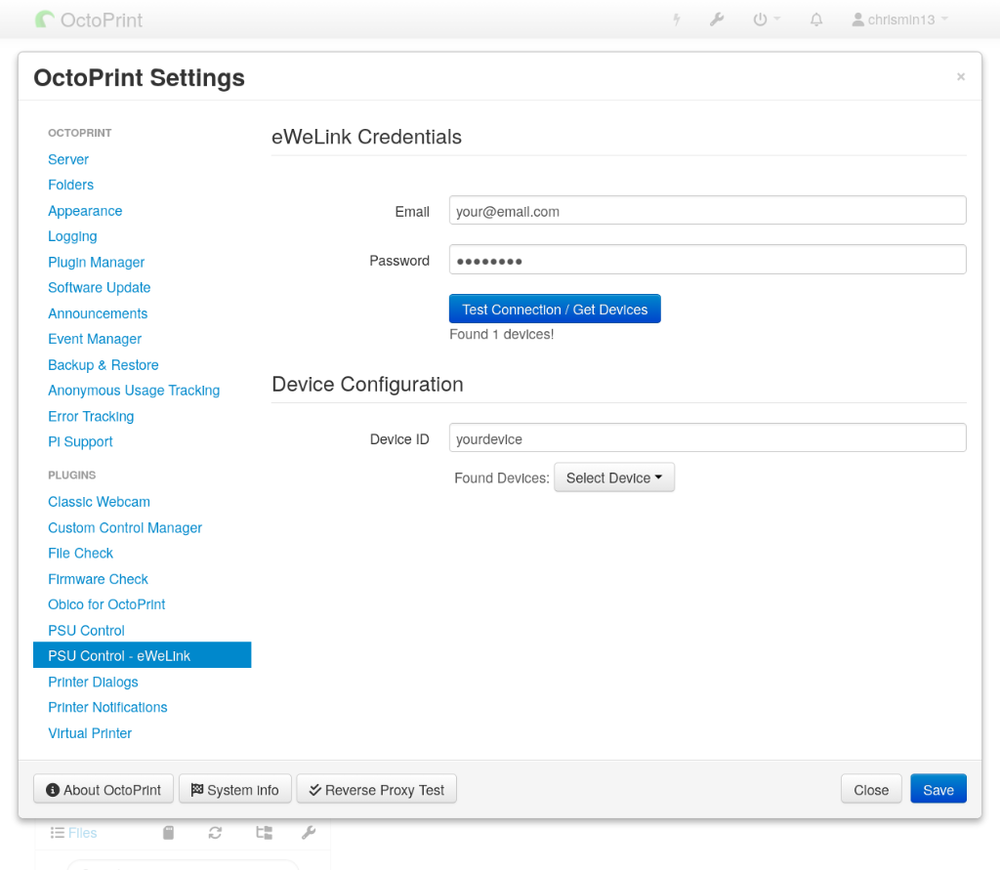

# OctoPrint-PSUControl-eWeLink

Integrate [eWeLink](https://ewelink.cc/) smart switches (Sonoff, etc.) with [OctoPrint-PSUControl](https://github.com/kantlivelong/OctoPrint-PSUControl) to turn your 3D printer on and off.

<p align="center">
  
</p>

> [!WARNING]
> This plugin is entirely **vibe coded**. While a lot of time and care has been put into making sure that it works, it's easy to use, looks nice, and that it is safe and secure to use, this cannot be guaranteed, and it is provided as-is.
>
> Due to it being vibe coded, this plugin cannot be submitted to the OctoPrint Public Repository.
>
> If this is not to your liking, please do not use this plugin.


## Requirements

*   **OctoPrint**: 1.3.10 or higher
*   **OctoPrint-PSUControl**: Installed and configured
*   **eWeLink Account**: Email and Password
*   **eWeLink Device**: A smart switch (e.g., Sonoff Basic, S26) connected to your printer

## 📦 Installation

> [!TIP]
> **Install URL** (copy this):
> ```
> https://github.com/chrismin13/OctoPrint-PSUControl-eWeLink/archive/main.zip
> ```

1. Open **OctoPrint Settings** → **Plugin Manager** → **Get More**
2. Paste the URL above into the **"... from URL"** field
3. Click **Install**
4. Restart OctoPrint when prompted

## Configuration

1.  Open **OctoPrint Settings** and navigate to **PSU Control - eWeLink** (under Plugins).
2.  Enter your **eWeLink Email** and **Password**.
3.  Click **Test Connection / Get Devices**.
    *   This will check your credentials and fetch your available devices.
    *   The region is auto-detected by the eWeLink API.
4.  Select your printer's smart switch from the **Device ID** dropdown.
5.  Click **Save**.
6.  Navigate to **PSU Control** settings.
7.  Set **Switching Method** to **Plugin**.
8.  Select **OctoPrint-PSUControl-eWeLink** from the plugin list.

## Security

This plugin takes security seriously:
*   **Obfuscated Storage**: Credentials are NOT stored in plain text. They are obfuscated using XOR with a local salt in `config.yaml` to prevent casual exposure.
*   **UI Masking**: Passwords are masked (`********`) in the settings UI and stripped from the browser memory.
*   **Secure API**: Credentials are transmitted to the eWeLink API over HTTPS.

## Releasing

Releases are automated via GitHub Actions. To create a new release:

1. **Bump the version** in `pyproject.toml` (line 7: `version = "X.X.X"`)
2. **Update** `docs/CHANGELOG.md` with release notes
3. **Push to main** - the workflow automatically:
   - Runs unit tests
   - Creates a GitHub release with the version tag
   - Generates release notes

You can also trigger a release manually from the **Actions** tab → **Release** → **Run workflow**.

> **Note**: The plugin registry metadata is in a separate repo: [`plugins.octoprint.org/_plugins/psucontrol_ewelink.md`](https://github.com/OctoPrint/plugins.octoprint.org). Update it when changing plugin description, compatibility, or screenshots.

## Documentation

| Document | Description |
|----------|-------------|
| [Troubleshooting](docs/TROUBLESHOOTING.md) | Common issues and solutions |
| [Security](docs/SECURITY.md) | How credentials are protected |
| [API Reference](docs/API.md) | Internal APIs and integration points |
| [Architecture](docs/ARCHITECTURE.md) | Technical design overview |
| [Development](docs/DEVELOPMENT.md) | Setup for contributors |
| [Translations](docs/TRANSLATIONS.md) | How to add and maintain translations |
| [Changelog](docs/CHANGELOG.md) | Version history |
| [Privacy Policy](PRIVACY.md) | Data handling practices |

## License

MIT
